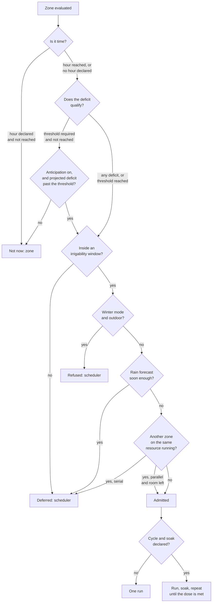

# Scheduler — Design Note

An analysis of **what the scheduler is for**, and of the gap between the
decisions the model already records and the behaviour that actually runs. It
complements `../design_domain_object_model.md` (the map of the domain classes),
`actuator-abstraction.md` (the layering question this one sits above) and
`flow-rate-provenance.md` (which flow rate answers which question).

**Status: Draft.** Open for comment. §14 tracks the questions this note raised:
**Q1-Q3 have working answers** (2026-08-21) and the sections above are written
to match them; **Q4-Q9 are open**, and they are what feedback is most wanted on.
Q8 is the most consequential for the interface: it asks whether a zone should
declare a time at all.

**Read §8 before changing anything there, because it records a removal.** The
supply check that once gated admission on measured flow is gone, deliberately:
the measured rate is an *effect* of how the scheduler ordered the zones, and a
layer that decides cannot take its own output as an input. Code carries no trace
of what was taken out of it, so this note is the only place that removal is
written down, and re-adding the check for a locally sensible reason is the
easiest regression this design allows.

**Added 2026-09-27**, and not yet reflected in §14: §8.4.5 (an interrupted run,
rain closing the runs, and why both belong here), §8.4.6 (two fixed
environments, outdoor and greenhouse, and the shared pump declined) and §8.4.7
(the automation a user built instead, read as a specification).

Nothing is binding while the note is `Draft`: a working answer is still a
proposal.
Lifecycle: `Draft → Proposed (open for comment, "RFC") → Accepted ("ADR")`.

Related: GH #74 (actuator abstraction and the unified-scheduler question —
primary discussion thread) and GH #95 (master pump). Throughout, a scheduled run
is taken not to consult the reactive threshold: the two modes answer different
questions, and the note says where that matters.

---

## 1. Why this note exists

`scheduler.py` today answers one question, per zone, in isolation: *may this
zone water right now?* The answer is binary — water, or skip with a reason.

That question turns out to be too small for three things users are asking for,
and for one the model already promises and does not deliver:

- **Rain delay.** `RainDelayPolicy` is written into the model but nothing reads
  it, and the forecast feed it depends on is never even read from Home
  Assistant. The integration promises a rain delay it cannot perform.
- **Time windows.** There is no way to say "never water between 09:00 and
  18:00" — a legal restriction in some regions, a tariff question in others,
  and an evaporation-loss question everywhere.
- **Cycle & soak.** `CycleSoakRule` is written into the model, has tests, and
  has no caller. Clay and slopes shed a 30-minute run; the same volume in
  3×10 minutes with soaks in between goes into the soil instead of the path.
- **Parallel runs.** Named as a policy, never constrained by hydraulics.

Each of these has been treated as a separate feature. They are not: they are
four faces of one question the scheduler does not currently ask —
**what is admissible right now?**

## 2. Where the scheduler is today

The nouns are largely present. The verbs are largely missing.

| Concept | Where | State |
|---|---|---|
| `IrrigationMode` — MANUAL / REACTIVE / SCHEDULED | `zone.py:127` | **shipped**, wired at `controller.py:230` |
| `irrigation_time` (fixed start for SCHEDULED) | `zone.py:237` | **shipped** |
| `Scheduler.evaluate_scheduled` / `evaluate_reactive` | `scheduler.py:128,142` | **shipped**, called from `controller.py:394,408` |
| `Decision` / `Trigger` / `SkipReason` | `scheduler.py:64,92` | **shipped** |
| `ConcurrencyPolicy` SERIAL / PARALLEL | `scheduler.py:78` | static field; only `SERIAL` is reachable in practice |
| `Scheduler.next_eligible` | `scheduler.py:152` | written and tested — **no production caller** |
| `CycleSoakRule(max_segment_s, soak_s)` | `zone.py:150` | written and tested — **no production caller** |
| `RainDelayPolicy(enabled, probability_threshold, delay_hours)` | `environment.py:155` | written — **zero consumers anywhere** |
| `rain_probability_sensor`, `SensorKind.RAIN_PROBABILITY` | `environment.py:194,107` | binding declared — **never offered in the config flow, never read** |
| Irrigability windows | — | **do not exist** |
| Deferral state (how many times a zone was delayed) | — | **does not exist** |

Two entries deserve emphasis, because they change what this work is. Most of
it is not new design — it is **wiring model that was already agreed and
written**. And the rain delay is not an unimplemented idea: it is a feature the
domain model presents as part of the site's policy, with no path from the sky
to the decision.

## 3. Deferring is not skipping

The first correction this note proposes is to the shape of `Decision` itself.

Today a non-watering answer is a `SkipReason`. The four existing reasons —
`NOTHING_TO_REFILL`, `BELOW_THRESHOLD`, `ALREADY_RUNNING`, `THROTTLED` — share a
property that is easy to miss and load-bearing:

> **A skip is re-derivable.** Ask again in ten minutes with the same world and
> you get the same answer. No history is required to be correct.

A rain delay does not have that property. Asked twice with an identical world —
same deficit, same forecast, same hour — the *correct* answer differs depending
on **how many times the zone has already been deferred**. The first 90% forecast
should postpone; the fourth in a row, with the deficit still climbing, should
not.

That is why a delay cannot simply be a fifth `SkipReason`: `Decision` is
`frozen` and memoryless by construction, and adding a reason that silently
depends on unrecorded history would make the same value object mean two
different kinds of thing.

**Proposal — three outcomes instead of two:**

| Outcome | Meaning | Carries | Bounded? |
|---|---|---|---|
| `GO` | Water now | `Trigger` | — |
| `DEFER` | *The need stands; not now* | `DelayReason`, `deferred_until`, `attempt` | **yes — must be** |
| `SKIP` | Nothing to do | `SkipReason` | no budget, no memory |

The distinction that matters operationally is the last column. **An unbounded
deferral is indistinguishable from a skip**, and its failure mode is silent: a
garden that never waters because the forecast said 90% five mornings running,
while the integration logs a reason that sounds reassuring every time. Bounding
the deferral is not a refinement of the feature — it is the thing that makes the
feature safe to ship.

## 4. The counter resets on satisfaction, not on rain

The obvious implementation is to ask, after the delay expires, *did it actually
rain?* That question is unnecessary, and asking it would create a second source
of truth about water that has already been accounted for.

**The deficit already knows.** If the rain arrives, `Zone.accumulate()` credits
it, the deficit falls below `threshold_mm`, and the zone leaves the deferral
chain by itself through `BELOW_THRESHOLD` — an ordinary skip. If the rain does
not arrive, evapotranspiration keeps running and the deficit keeps climbing,
which is exactly the pressure that should eventually override the delay.

So there is one rule, with no special case for rain:

> The deferral counter resets when the zone stops needing water — **however that
> happened**: forecast rain that arrived, a manual watering, a service reset.

This also settles where the counter lives. The scheduler is stateless by design
("*holds no state about the world*" — `scheduler.py:112`), and that property is
what makes its rules testable without a controller. The counter is state about a
*zone*, so it belongs on the `Zone` alongside `last_irrigated`, and it enters the
scheduler as an argument, exactly as `is_running` and `is_throttled` do today.

**It must survive a restart.** A counter held only in memory means every Home
Assistant restart silently refills the deferral budget — the same class of defect
as the restart gap already documented in `controller-reliability.md`, and just as
invisible from the logs.

## 5. Two independent brakes, not one

A count of deferrals is blind to both time and physics. Three deferrals of
twelve hours in August is not the same event as three deferrals of twelve hours
in late September, and no number of counted rinvii tells the plants apart.

Two brakes should act in parallel, either of which ends the deferral:

- **Budget** — `max_deferrals`, on `RainDelayPolicy` (Q3). The user-facing knob,
  easy to explain, easy to reason about.
- **Physical ceiling** — the deficit approaching `d_max`. Plants suffer from the
  deficit, not from a counter. Past that point the delay lapses **regardless of
  remaining budget**.

The second is the safety net, and the model already holds the right number to
express it: `d_max` is per-zone (soil type × root depth), so the ceiling is
per-zone too, which is correct — a shallow-rooted bed runs out of margin long
before a deep one under the same sky.

## 6. The delay predicate has three terms, not one

The motivating example — "90% chance of rain, so wait" — hides a problem.
**Probability is not quantity.** A 90% chance of 0.2 mm refills nothing, and a
delay decided on probability alone will postpone watering for drizzle, then
postpone again, spending the budget from §5 on rain that was never going to
matter.

The predicate that actually expresses the intent has three terms:

> **enough rain, likely enough, soon enough.**

| Term | Model support today |
|---|---|
| likely enough | `probability_threshold` (default 0.60) — **present** |
| enough rain | expected quantity, weighed against the zone's deficit — **absent** |
| soon enough | forecast horizon — **absent** |

On the third term there is a rule worth stating rather than configuring:
**the forecast horizon should equal `delay_hours`.** Look ahead exactly as far
as you intend to wait. If the plan is to postpone twelve hours, a high
probability at 48 hours is not a reason to postpone — it is a different
decision being smuggled in under the same number.

### 6.1 What Home Assistant actually supplies

Expected quantity is not a quantity NeverDry would have to derive: it is a
first-class field of Home Assistant's `Forecast` typed dict —
`native_precipitation` (`homeassistant/components/weather/__init__.py:190`) —
carried in **the same forecast entry** as `precipitation_probability`. One
`weather.get_forecasts` call returns both.

Every field except `datetime` is optional (`total=False`), so the design
question is not whether Home Assistant models the quantity, but **how many
integrations populate it**. Measured across the core integrations of HA
**2026.2.3**, counting the actual `Forecast` dict keys
(`ATTR_FORECAST_NATIVE_PRECIPITATION` / `ATTR_FORECAST_PRECIPITATION_PROBABILITY`
and their literal forms):

| Supplies | Integrations | Count |
|---|---|---|
| **Both** | `accuweather`, `aemet`, `buienradar`, `google_weather`, `met`, `tomorrowio`, `weatherkit` | 7 |
| **Quantity only** | `meteo_france`, `open_meteo`, `smhi` | 3 |
| **Probability only** | `environment_canada`, `ipma`, `metoffice`, `nws` | 4 |
| At least one | | **14** |

*Method: the counts match on the forecast keys themselves, not on the string
"precipitation" — a looser match inflates them by picking up
`_attr_native_precipitation_unit` (a unit declaration) and vendor API keys such
as AccuWeather's `PrecipitationProbabilityDay`. Core integrations only; custom
and HACS weather integrations were not measured.*

**Neither field can be required.** They are available in roughly equal measure —
10 against 11, overlapping in 7 — so demanding probability excludes
Météo-France, Open-Meteo and SMHI users, while demanding quantity excludes Met
Office, NWS and Environment Canada users.

### 6.2 The predicate degrades; it is not all-or-nothing

This corrects the framing above. Expected quantity is not an *extra term to
decide whether to include* — it is one of two interchangeable pieces of
evidence, and which one arrives depends on the user's weather integration. The
predicate should therefore degrade to what is actually supplied:

| Available | Predicate | Consequence |
|---|---|---|
| Both | enough rain, likely enough, soon enough | The intended behaviour |
| Quantity only | enough rain, soon enough | A forecast of 8 mm *is already* the claim that it will rain; probability adds nothing |
| Probability only | likely enough, soon enough | Today's design — defers on drizzle |
| Neither | rain delay unavailable | Must be said at configuration time, not discovered by a garden that never waters |

**The stakes are lower than they look**, and that is worth stating plainly
because it decides how much this may hold up a first version. §4 established
that the deficit self-corrects: if the forecast rain does not arrive,
evapotranspiration keeps running and the deficit climbs back. Quantity is
therefore not required for **correctness** — it is required to avoid **spending
a deferral from the §5 budget** on rain that was never going to refill anything.
It is an optimisation, and shipping without it is defensible *provided the
budget is bounded*. Without the bound, the drizzle case becomes unbounded
postponement and the optimisation turns load-bearing after all.

Which degradation modes ship first is open question **Q4**.

## 7. The forecast feed is not connected

This is the gap that makes the rain delay undeliverable today, and it is broken
in four places, not one.

1. **Config flow.** There is no field to bind the entity. The binding exists
   only in the pure model; a user has no way to supply it.
2. **Shape of the source.** `rain_probability_sensor: str | None` assumes a
   `sensor.*` entity. In Home Assistant, rain probability is most often an
   **attribute of a `weather.*` entity's forecast**, reachable through the
   `weather.get_forecasts` service — not a readable state. As declared, the
   binding likely has the wrong shape for the majority of installations. The
   measurement in §6.1 sharpens this: **both** pieces of evidence the predicate
   can use arrive from that one service call, so a `weather.*` binding gets the
   degradation of §6.2 for free, while a `sensor.*` binding needs two separate
   entities that, for most integrations, the user would have to build by hand
   with a template. See **Q5**.
3. **Units.** Home Assistant reports `precipitation_probability` as an
   **integer 0–100**. `probability_threshold` defaults to **0.60**, a fraction.
   Fed to `triggers_at()` unconverted, every forecast clears every threshold and
   the zone defers permanently. This is precisely the `flow_rate` L/min-vs-L/h
   defect the project has already been bitten by: it passes every unit test and
   only appears in the field. Normalise at the I/O boundary, per
   `unit-system.md`.
4. **Reader.** Nothing converts the state into a float, and nothing calls
   `RainDelayPolicy.triggers_at()`.

Point 3 is the one to design against deliberately. The rain delay fails *silently
towards not watering*, which is the direction a user notices last.

## 8. Serial or parallel is an admission decision

`ConcurrencyPolicy` is a static field today, and `allows_overlap` is consulted
as a fixed property of the installation. That is not sufficient for parallel
operation, because it answers only half the question.

> **The policy says *may I*. The hydraulics say *can I*.**

`PARALLEL` on its own is a promise the pipe cannot keep: one well, one pump, one
main. Admitting a zone to run concurrently requires two conditions, evaluated
**at the moment of admission** rather than once at startup:

1. the policy permits overlap;
2. `max_concurrent_zones` is not saturated.

**There was a third, and removing it is the substantive change here.** It read:
*the flow demanded by the active runs plus the candidate fits within the
supply*. It is arithmetically sensible and it cannot be implemented, for three
reasons that compound.

**There is no supply figure to compare against, and there will not be one.**
Nothing in the installation records what the source can deliver, so the check
had no right-hand side. The obvious repair - ask the user for it - is refused
deliberately: in an ordinary garden nobody knows what their main delivers, and
a field asking for it would be answered with a guess that then looks like a
measurement. This project has made that decision once already, for the soil,
where the reasoning is recorded as *asking for both as figures would be asking
twice for something nobody owns*. The same holds here, and worse, because a
wrong ceiling would silently forbid overlaps that are perfectly fine.

**The measured rate is not available when the decision is made.** A zone's rate
is measured over its first runs, so at the moment a scheduler would most like a
number, there is not one - and the design rate it falls back on is the figure
`flow-rate-provenance.md` already warns is routinely out by an order of
magnitude.

**And the measured rate is an effect of scheduling, not an input to it.** This
is the one that settles it. Run two zones together and the measured rate of
both falls - that is the whole reason serial is the default (§8.1). A scheduler
that admits or refuses overlap based on measured flow is deciding on a
consequence of its own decisions. The loop is not in the wording; it is in the
quantity.

So the supply is not consulted. **The policy is declared by the person who can
see their plumbing, and the scheduler obeys it.** Where somebody declares
`PARALLEL` on a source that cannot feed two zones, the result is worse
irrigation on both, and the honest place to say so is the documentation and the
configuration form - never a run-time refusal computed from a number that does
not mean what it would have to mean.

Measured flow stays what `flow-rate-provenance.md` makes it: evidence about a
zone, reported to a person. It does not become a gate.

### 8.1 The field says serial is the default, not the option

Two reports within a fortnight, on unrelated hardware, and they converge:

- **Eleven zones on one installation, all set to 05:00, one watered** (GH #270).
  The others were not deferred; they were dropped.
- **Two Netro controllers, each running one solenoid at a time** (GH #239,
  @safepay), asking for the zones of one entry to *queue* rather than be
  skipped, in both reactive and scheduled modes.

The second report carries the argument this note was missing, and it is not
about convenience. Zones are sized to use most of the supply available, so
running two at once is not slower, it is **wrong**:

> "My lawn zone draws 31 L/min, and my vegetable zone only 3 L/min. Opening
> both at once lowers the pressure, which changes the flow of both zones.
> NeverDry's run times are calculated as volume / flow rate. When two zones
> overlap, both flow rates are wrong, and the deficit NeverDry records as
> replaced doesn't match what was actually delivered."

That closes a gap in §8 above. The three admission conditions treat supply as a
budget to divide, which is right arithmetically and incomplete physically:
overlapping runs do not each get their share of a fixed flow, they **change
each other's flow**, and every figure downstream is then computed from a rate
that no longer holds. The delivered volume is credited wrong, so the deficit is
wrong, so the next run is wrong - and nothing in the system can see it, because
the meter is per zone and the pressure is not.

So parallel operation is the special case, for a site with supply to spare, and
**serial is the safe default**. The note had it the other way round by
omission: `ConcurrencyPolicy` is a field with two values and no stated default,
and §10's *"both modes become subject to the envelope"* reads as though the two
were equals.

**What it costs to have had this wrong.** Nothing yet in the model - serial is
what actually happens today, because both dispatch callbacks return when
something is running. What it cost is the *queue*: serial without a queue is
not serial scheduling, it is one zone winning and the rest losing, which is
exactly what both reporters saw.

### 8.2 Where the boundary of "one at a time" sits

Serial by default raises the question the two reports answer differently, and
neither answer is wrong.

@safepay would model two Netro controllers as **two NeverDry entries**, one per
controller, and wants each entry to queue its own zones - explicitly *not*
asking for valve groups. So for that installation the boundary is the config
entry, and it falls out of the setup without anything new to configure.

A third position was raised in this project: that the choice belongs to **the
zone** - parallel, serial, or custom - rather than to the installation. It sits
against what §8 argues (the constraint is the shared hydraulics, which is a
property of the plumbing and not of any one zone), and "custom" has no
definition yet. Recorded here rather than resolved, as Q9.

A third was deferred long ago: a **declared group** of zones that share a pipe,
a pump or a well (GH #74). It is the only one of the three that describes the
constraint directly, and it does not survive contact with the installations we
actually have.

| boundary | what it means | who wants it |
|---|---|---|
| the config entry | one entry, one queue | @safepay, and it needs no new field |
| the zone | each zone declares how it may overlap | raised in this project |
| a declared group | zones sharing a pipe are named together | nobody, on the evidence below |

**Nobody is asking for groups, including the person with the most complicated
site.** @safepay runs two controllers and says in the same breath: *"I'd model
these as two separate NeverDry entries, one per controller. So I'm not asking
for valve groups."* Karl has eleven zones on one installation and needs a
queue, not a partition. A maintainer with one valve per line and one source
gets nothing from a group at all.

**The one shape that would need it** is two independent sources inside a single
entry - two pumps, or a well and the mains - where three zones compete with
each other and two do not. That is a real configuration and it is a rare one,
and it has not been reported.

**And it is the only option that asks the user for something they can get
wrong.** A group is a claim about plumbing the software cannot check, and a
wrong group is indistinguishable from a right one until the pressure drops
during a run that was admitted on its strength.

So: **the entry is the default boundary, and a group is what you declare when
it is not enough.** Optional, absent unless asked for, and the two cases that
ask for it are already on file - the well gate of GH #74 and the master pump of
GH #95, both of which are a set of zones sharing one thing that only one of
them can use at a time.

That ordering is what keeps the cost where it belongs. Nobody is asked to
partition a garden they never needed to partition; somebody with two pumps can
say so. And because a group is declared rather than inferred, an installation
that says nothing behaves exactly as it does today.

The entry boundary does have a failure of its own, and it is worth naming
rather than discovering: two entries pointed at valves on the *same* main is a
configuration nobody is stopped from making, and the system would treat as
independent two things the plumbing does not.

### 8.3 A queue waits for a closed valve, not for a timer

@safepay's hardware adds a constraint the queue design has to carry, and it
generalises past Netro. The integration polls, waits about five seconds after
each command before re-reading, and is capped at 2,000 API calls per device per
day, so valve state lags by at least one poll.

> "The queue should wait for the previous valve to be confirmed closed before
> starting the next. Otherwise it may start a zone while the controller still
> reports the previous one as running."

This is the same discipline as the delivery contract: act on confirmation, not
on elapsed time. A queue that starts the next zone when the previous run's
*duration* ends is assuming the valve obeyed, on hardware that has already said
it reports late. Whatever §10's recomputation ends up looking like, the hand-off
between zones is a state transition and not a timer.

There is a second-order cost worth naming, because it is easy to design past: a
poll-limited device cannot be asked more often just because a queue would like
to move sooner. 2,000 calls a day is roughly one every 43 seconds across a
device's whole day, shared with everything else the integration does.

### 8.4 What the zone decides, and what the scheduler decides

The questions above kept circling one confusion, so it is worth settling
separately from any of them: **a zone declares what it wants; the scheduler
decides when that can happen.** Every setting belongs to one side or the other,
and a setting on the wrong side is how Q9 got difficult.

#### 8.4.1 The zone declares two things

**What triggers its watering.** Not a list of modes but **two independent
questions**, which is what keeps the set complete instead of being whichever
combinations somebody thought of:

- **When is the zone considered?** At a declared hour, or at every evaluation.
- **How much deficit qualifies?** Any at all, or only once it has reached the
  zone's threshold.

Two binary axes, four modes, and each cell is a garden somebody has:

|  | **any deficit** | **only at the threshold** |
|---|---|---|
| **at an hour** | waters at its hour and brings the deficit back to zero, however small it was | waters at its hour, but only if the soil has actually dried to the threshold |
| **on the deficit** | waters as soon as there is any deficit: small doses, often | waters when the deficit reaches the threshold |

Read the cells rather than the labels, because the two that look odd are the
two that matter most.

**At an hour, any deficit** is the top-up: a fixed evening habit, the garden
kept level, no surprises. It waters a barely-dry garden, which is the point and
also its cost.

**On the deficit, any deficit** is small and frequent, and it is not a
degenerate case. It is how pots, seedbeds and sandy ground are watered, where
waiting for a threshold means letting them dry out in between - the threshold
exists for soil with a reservoir to draw on, and these have very little.

**At an hour, only at the threshold** is the one missing today, and the one
asked for without being named: *"water at six, but not if it does not need
it"*. Without it the choice is between a schedule that waters a wet garden and
a reactive mode that may water at an unwelcome hour.

**On the deficit, only at the threshold** is what the product does now.

**Two axes is the structure, not the interface.** The pair guarantees the set is
complete; it does not follow that a user should be asked twice. The form this
note assumes is **one dropdown with four entries**, named after gardens rather
than mechanisms - *every evening*, *when it needs it, in the evening*, *little
and often*, *when the ground is dry* - with the axes behind them. It is the same
discipline the project already applies elsewhere: the dropdown decides, and
what lies underneath is ours to keep coherent rather than the user's to
assemble.

That is a proposal and not a decision: nobody has seen those four names beside
each other in a real form, and a name that reads well in a design note can still
be the one nobody picks.

Note what the hour is **not**, per §10.1: even in the top row it is a request,
not a promise. Eleven zones cannot all start at 05:00, so a declared hour is
read as *not before this*.

**How it waters, once admitted.** One shot, or cycle and soak. The zone declares
the two durations or neither:

- both empty: one continuous run;
- both given: run, wait, run again, for as long as the dose needs;
- **one given and not the other is refused.** A soak with no cycle is not a
  degraded configuration, it is an unanswerable one, and the form should say so
  rather than pick a default - the same discipline as the two ends of a Custom
  soil (`soil-moisture-model.md` §5).

#### 8.4.2 The scheduler decides six things, for everyone

None of these is per zone, and pushing any of them onto a zone is what produces
contradictions between zones:

1. **Order and concurrency.** Serial by default (§8.1), parallel where declared,
   and a queue so that a zone which becomes due while another is running waits
   rather than being dropped (§10).
2. **The irrigability envelope.** When watering is permitted at all (§9.1).
3. **Weather that has not happened yet.** A single installation-wide rule, and
   it does two things rather than one.

   *Defer:* if enough rain is forecast soon enough, hold the run. Not per zone -
   a forecast is about the sky, and the sky is not a property of a zone.

   *Anticipate:* bring a run **forward** when leaving it would cost more than
   doing it now. This is @rpatel3001's request on GH #138, and it is the sharper
   half: *"water when the current deficit is above the minimum and the forecast
   deficit is above the maximum"*. A hot day coming and no rain means watering
   tonight rather than at noon tomorrow; rain coming means not watering at all,
   even though the soil is dry enough to justify it.

   **Why it needs a band and not a threshold.** Without a lower bound, a hot
   forecast would water ground that is barely dry. Without an upper bound, there
   is nothing to compare the projection against. The band is what makes
   anticipation safe.

   **And why both ends can live here rather than on the zone.** The upper bound
   already exists and is per zone: it is the zone's own threshold, the point at
   which it wants water. So the scheduler does not need a second number per
   zone - it needs two of its own:

   - *how far it may anticipate*, as a fraction of each zone's threshold. At
     0.7, a zone with a 12 mm threshold becomes eligible for anticipation at
     8.4 mm, and one with 20 mm at 14 mm. One setting, proportionate everywhere.
   - *how far ahead to look*, in hours.

   The deficit is the zone's, but the scheduler is what reads it, so nothing is
   moved to the wrong side by doing this here.

   **What it anticipates is the deficit, never the clock.** A zone that declares
   an hour still does not start before it. Anticipation lets a run happen while
   the soil is drier than the zone's own floor and not yet at its threshold; it
   does not move the hour the user chose, and a zone set to six that watered at
   ten the night before would be exactly the surprise this note spends its
   length avoiding. In the diagram of §8.4.3 that ordering is visible: the
   question about time is asked first and answered alone.

   **Left empty, anticipation does not run.** Not a conventional value, not a
   sensible default: absent. The scheduler then behaves exactly as it does
   without this feature, which is what an installation that never asked for it
   must keep doing - anticipation changes *when a garden is watered*, and
   turning that on by default would move somebody's watering from tomorrow
   morning to tonight because they upgraded. That is the failure `const.py`
   already describes for soil: a default nobody is told about is the hardcoded
   constant, with a dropdown in front of it.

   **And one of the two without the other is refused**, as with cycle and soak
   (§8.4.1) and the two ends of a Custom soil. A horizon with no anticipation
   floor is not a degraded configuration, it is an unanswerable one, and the
   form should say so rather than invent the missing half.

   **The separation `rain-input` establishes holds throughout, and this is where
   it earns its keep.** A projected deficit decides *whether to run*. It never
   becomes the deficit: only observed rain and delivered water move that number.
   A forecast that does not arrive must leave the model exactly where it was,
   otherwise a dry garden is recorded as watered by weather that never came.
4. **Frost and the winter interlock.** An outdoor zone is not watered when the
   installation is in winter mode or the observed conditions say freezing
   (§9.2). Indoor zones are unaffected, which is the one place the zone's own
   declaration enters - and it is a statement of fact about the zone, not a
   preference.
5. **A shared resource, where one is declared.** Optional, and off unless
   somebody says otherwise - §8.2 sets out why groups are not asked of everyone.
   But the case they exist for is real and is already on file: the well gate of
   GH #74, and a master pump on GH #95. Where two zones draw on one pump, one
   well or one main, naming them together is the only way to say so, and the
   scheduler then serialises within that set rather than across the whole entry.

   Declared, never inferred. A group is a claim about plumbing the software
   cannot check, so an undeclared installation behaves exactly as it does today:
   one entry, one queue.

   Where a group's plumbing crosses the two environments of §8.4.6 it is not
   coordinated, and §8.4.6 says what happens instead.

6. **The smallest dose worth delivering.** Without one, the two *any deficit*
   modes of §8.4.1 degenerate: a deficit of 0.3 mm opens a valve for a few
   seconds, the ground does not notice, a meter with a one-litre resolution
   cannot see it, and the actuator has spent a cycle on nothing.

   **A site setting, in millimetres** - inches where the installation is
   imperial, like every other length in the product. Millimetres rather than
   litres because the same number then means the same thing on a 5 m2 zone and
   on a 200 m2 one, and because it sits in the unit the deficit and the
   threshold are already in, so the three can be compared without converting
   anything.

   Below it the zone is not watered **and keeps its deficit**, which goes on
   growing until the dose is worth delivering. The run is postponed, never
   cancelled: nothing is lost, and a small zone simply waters less often than a
   large one, which is what it should do anyway.

   Note what it is not: a second threshold. The zone's threshold says *when the
   soil needs water*; this says *when opening a valve accomplishes anything*.
   One is about the garden, the other about the plumbing, which is why they
   live on different objects - and why this one is not per zone.

   There is a floor in the code already and it protects nothing: the controller
   skips a zone whose volume is `<= 0`. It has to become a number somebody can
   set.

#### 8.4.3 The path of one decision

Read top to bottom: every diamond is a place a zone can be stopped, and the
label on the arrow says **who** stopped it. A zone that reaches the bottom opens
its valve.



Three things the shape makes visible that prose did not.

**The zone's two questions are asked first and answered alone.** Nothing about
windows, weather or other zones can make a zone water that does not want to,
and the two questions are asked in order - time, then deficit - so the four
modes are two diamonds rather than four branches. That is also what keeps a
scheduled top-up from quietly becoming a reactive one.

**Anticipation is the one place the scheduler can make a zone water earlier
than the zone asked**, and it is deliberately a side path rather than a change
to the zone's own question: the zone still has to be past the anticipation
floor, and the projection has to clear the zone's own threshold. It brings a
run forward; it never invents one.

**Everything else that the scheduler does defers**, and there is exactly one
path that ends in a refusal rather than a deferral: the winter interlock. The
difference matters - a deferred zone is still waiting and will be reconsidered,
a refused one will not be until the condition changes.

**Cycle and soak happens after admission, not before.** It shapes the run; it
has no part in deciding whether the run happens. Which is also why a queue must
treat a soaking zone as still occupying its slot unless interleaving is turned
on (§11).

#### 8.4.4 Three things the shape does not yet hold

Written as gaps rather than answers, because each one is asked on an open issue
and none is settled.

**A deadline is a constraint on the end, and everything here constrains the
start** (GH #231). @sanderaernouts wants watering *finished* before sunrise: a
drip hose in a front garden facing the sun, where watering at noon is the
problem. The irrigability envelope (§9.1) says when a run may *begin*, and Q2
asks what happens to a run still going when the window closes. Neither is a
deadline.

Honouring one means working backwards: estimate the duration, subtract it from
the deadline, start then. Two things make that harder than it sounds, and both
should be stated before anyone builds it.

*The estimate is the weakest number in the system.* Duration is volume over
flow rate, and `flow-rate-provenance.md` is an entire note about how unreliable
that rate is until it has been measured. A deadline computed from it is a
promise made on a figure known to be wrong, and missing it is exactly the
failure the user was trying to avoid.

*And with a queue, the calculation is not per zone.* Eleven zones that must all
finish before sunrise need the backward calculation over the whole queue, not over each
run. That turns the scheduler from something that answers *may this zone start
now* into something that plans a sequence - a different object, and a much
larger one.

A cheaper reading, worth testing against the reporter before building the
expensive one: a deadline that only *refuses to start* a run it does not
believe will finish in time, and lets the envelope handle the rest. That keeps
the scheduler stateless and turns a missed deadline into a run that never
began, which for a front garden in the sun may be the right answer anyway.

**Rain that arrives mid-run** (GH #213). Deferring for forecast rain is
settled (§8.4.2); stopping a session because rain is *falling* is not, and it
is a different question.

One worry can be set aside: there is no double counting. Water delivered and
rain fallen are two real contributions and both should reduce the deficit -
the run credits what the valve delivered, the rain credits what the sky
delivered, and the zone genuinely received both.

What is open is smaller and practical. **How much rain stops a run** - a rate,
or an amount accumulated since it started? And **is a stopped run resumed**?
A session cut short leaves the deficit partly unmet, and the difference between
*suspended* and *abandoned* decides whether the zone queues again in twenty
minutes or waits for its next ordinary turn.

**Both are answered in §8.4.5**, written after this section and against it. The
resumption half turns out not to be a question about rain at all - it is the
same question three different interruptions ask - and of the rain half what
stays open is one number rather than two questions.

**A manual run is not scheduled, and must not be filtered as though it were**
(GH #214). The smallest-dose floor of §8.4.2 exists to stop the *scheduler*
opening a valve for nothing. Applied to a person who has chosen to water for
two minutes, it becomes a refusal of an explicit instruction.

The same holds for the rest of the path: a manual run bypasses the envelope,
the modes, the anticipation band and the queue's ordering - though **not** the
queue's mutual exclusion, because two valves on one pipe is a physical
constraint and not a policy, and not the winter interlock, which protects the
plumbing rather than the schedule.

Worth stating plainly because the direction of drift is predictable: every
guard written for the automatic path is a guard somebody will eventually apply
to the manual one, each time for a locally sensible reason.

#### 8.4.5 Resuming an interrupted run belongs here

Three things in this note interrupt a run, and they were written as three
separate problems:

- a configuration change reloads the entry and cuts short whatever was watering
  (GH #282);
- rain begins while a zone is running (GH #213, and §8.4.4);
- a zone is dropped rather than queued because something else was running
  (§8.1, GH #270 and GH #239).

They are one problem. Each leaves a zone that was given part of its dose, and
each asks the same question: **does it get the rest, and when?**

**And the answer belongs to the scheduler, because nothing else knows enough to
give it.** Resuming is not a property of the session that was cut short: it
needs to know whether the irrigability window is still open, whether another
zone now holds the shared resource, whether it has rained since, and whether the
installation has meanwhile entered winter. Those are the scheduler's four
questions from §8.4.2, asked again. A session object that resumed itself would
be re-deciding admission with none of the information admission is decided on.

**Half of it is already free, which is worth knowing before building
machinery.** A zone that waters *on the deficit* needs no resumption at all: the
water it did not receive is still missing, so its deficit is still above the
line, so it comes round again on its own at the next evaluation. The deferral
counter of §4 is the only memory involved, and it already exists.

**The half that is not free is the zone that waters at an hour.** Cut that run
short and the remaining deficit changes nothing, because the trigger is the
clock and the clock has passed. It waits a day - which is precisely the case
where a user notices, because they chose an hour for a reason.

So the shape is narrower than "resume interrupted sessions". It is: **a run that
was interrupted before delivering its dose makes its zone eligible again for as
long as the envelope allows, whatever its trigger says.** One rule, and it
turns the clock from a gate into what §10.1 already says it is - a lower bound
rather than a promise.

**Rain closes the runs, the zones do their own accounting.** That settles the
part §8.4.4 left open, and it settles it by splitting the question rather than
answering it once.

*Deciding is the scheduler's, and it is one decision for the installation.* Rain
that has begun falling is an event in the sky, not in a zone, so it does not
make sense to ask each zone separately whether it should stop: the scheduler
hears it once and closes what is running.

*Counting is the zone's, and it already works.* Each zone credits the water its
valve actually delivered up to the moment it closed - the ordinary settlement of
a short delivery - and the rain reaches it through the observed-rain channel
like any other rain. Nothing new is needed, and this is why the double counting
worried about earlier was never there: the two figures come from two different
places and describe two different things the zone received.

**"Everything running" means everything outdoors.** Rain does not fall in a
greenhouse or under a canopy, and closing a greenhouse's run because it is
raining in the garden would be the same error as refusing it for frost - which
§9.2 already refuses to make. The zone's indoor declaration is a statement of
fact, and it applies here for the same reason it applies there.

What stays open is narrower than before, and it is one question rather than
three: **how much rain closes a run.** A rate, or an amount since the run began?
Too little and a passing shower ends a watering that was needed; too much and
the zone keeps running under a downpour. That number wants the field, not this
note.

One distinction to keep, because it decides whether §8.4.5's rule applies: a run
closed *by rain* is not the same as one *interrupted*. The reload case leaves a
dose still wanted; the rain case may well have satisfied it, and the zone's own
deficit is what says which - not a flag on the session.

#### 8.4.6 Two environments, fixed, and the zone already knows which

§8.4.2 calls its six decisions site-level, and with a greenhouse in the
installation that word covers two different things.

Three of the six are not properties of an *installation* at all. They are
properties of a **place**:

- rain does not fall in a greenhouse, neither the forecast that defers a run
  (§8.4.2) nor the downpour that closes one (§8.4.5);
- the freeze interlock protects plumbing that is outdoors (§9.2);
- the irrigability windows exist for sun, evaporation and not soaking a lawn
  people are standing on - a greenhouse can be watered at noon, and the reasons
  the windows exist do not reach inside it.

Two more are properties of the **plumbing**, and stay single: the queue and its
mutual exclusion, because the water comes from one pipe whether or not a zone is
under glass, and the smallest dose worth delivering, which is about opening a
valve rather than about weather.

**The sixth is the declared group, and it is neither.** A group names plumbing
that zones share, and nothing stops an outdoor zone and a greenhouse zone from
sharing a pump. Coordinating that across the two environments is the one thing
this note declines to do, and the reason is worth stating rather than assuming:
it would mean NeverDry checking whether something else NeverDry controls has
already taken the pump - a check on a check - and the object that would have to
hold that state is the duplicated scheduler this section opens by refusing.

**So a group is declared inside an environment, and a pump shared across the two
is simply used twice.** That is a plain description of what happens, not a defect
waiting to be designed away.

What is owed is not coordination but a **refusal that says so**. NeverDry expects
**exclusive control of a declared pump**, and when it is about to start one that
is already running it stops and says exactly that, rather than starting it a
second time. The second start is what makes the first sequence's shutdown close
a pump somebody is still watering through, and an error naming the expectation
is what lets the installer see a conflict the software cannot otherwise detect.

One condition keeps it from misfiring, and it is the whole difficulty: it applies
to a pump **this sequence is not already driving**. A master pump that stays on
across a serial run, and lingers after the last zone, is the ordinary case on
GH #95 - a guard that could not tell that apart would fire on every zone after
the first, which is worse than no guard.

It is a workaround and is declared as one. It converts a conflict nobody can see
into a conflict somebody is told about; it does not make the shared pump work.

**So the scheduler is not duplicated; its inputs are.** Duplicating it would
duplicate the queue as well, and two queues on one pipe is the failure §8.1 is
written to prevent.

**Two environments, fixed: outdoor and greenhouse.** Not created, not named, not
deleted. That is the point rather than a simplification: an environment a user
can create is an environment a user can create *twice*, or leave empty, or fill
with zones that share a main with the other one - and every one of those is a
conflict the software could not detect. A closed list of two cannot conflict
with itself.

**And nothing new is asked of anybody.** Each zone already declares whether it
is outdoors; that is the declaration the freeze interlock reads today. So every
zone is already in one of the two environments, and what changes is only where
the three place-dependent settings live. An installation with no greenhouse has
one environment with zones in it and one without, and behaves exactly as it does
now.

What this leaves open is smaller and worth naming rather than assuming: whether
a greenhouse wants irrigability windows *at all*. The reasons for the outdoor
ones do not apply, and "any time" may simply be the honest answer - in which
case the greenhouse environment carries a freeze interlock that never fires, a
rain rule that never fires, and no windows, which is a fair description of a
greenhouse.

#### 8.4.7 What a user built instead, and what it tells us

@kstockl solved his eleven zones himself while this note was being written, with
a Home Assistant automation, and published it (GH #270). It is worth reading as
a specification rather than as a workaround: somebody with a real garden built
the missing object by hand, and the shape they chose is evidence about the shape
we should ship.

**What it confirms.** Eleven zones, strictly one after another, each waiting for
the previous one's duration before the next begins. Serial, queued, no overlap -
built that way by someone who never read §8.1.

**Three things it does that we would not, and each says something.**

*It waits a fixed delay rather than a confirmed close.* Fifteen to thirty
seconds between zones, chosen by hand. It works on his hardware and it is
exactly what §8.3 argues against: on a poll-limited controller the same
automation would open the next valve while the previous one is still reported
running. He cannot check for a confirmed close from an automation - which is one
reason the queue belongs in the integration.

*It reads the raw moisture sensor, not the deficit.* His condition is "soil
humidity below 20%", not "deficit past threshold". A user who has NeverDry
computing a water balance chose to bypass it for the number his probe publishes
directly. That is worth understanding rather than correcting: it may be the
uncalibrated scale of `soil-moisture-model.md` §4 making the deficit hard to
trust, or it may simply be that a percentage is legible and millimetres are not.

*It marks a zone irrigated in order to skip it.* When a zone does not need
water, the automation calls `mark_irrigated` - which zeroes a deficit that no
water repaid. It is the right move in an automation that has no memory: without
it the zone would be reconsidered on the next run. A scheduler with a queue does
not need it, because a zone that was not admitted is simply not admitted, and
its deficit stays true. Worth noting because the service was not designed for
this, and it is now in a published example other people will copy.

**And one thing it asks for that already exists.** He suggested being able to
hide the card's buttons, so that the relay reset cannot be pressed by accident.
The Custom layout added for GH #269 has a checkbox per section, buttons among
them - so the request arrived after the answer, which is the good direction for
once.

## 9. The irrigability envelope

This is the reframing the rest of the note depends on. The scheduler stops
answering *"should this zone water?"* and starts answering
**"what is admissible now?"**.

Admissibility has two site-level gates and one per-zone gate. They are different
in kind, and the difference decides how each is reported.

### 9.1 Time windows — declared

At **site level** (`Environment`) live the **irrigability windows**: the
intervals within which any run may begin. They exist for reasons that are all
site-wide and none of them per-zone — municipal restrictions, electricity or
water tariffs, wind, evaporation losses, and simply not soaking the lawn while
people are standing on it.

The windows are a **constraint**, not a schedule. They say when watering is
*permitted*, never when it *happens*. What happens inside them is still decided
by deficit, threshold and the rules above.

**The envelope wins over a zone's fixed hour** (Q1, resolved). A `SCHEDULED`
zone whose `irrigation_time` falls outside every window does not escape the
site's rules — see §14 Q1 for what happens to it instead. What a run that
*started* inside a window may do when the window closes under it is a **stated
Scheduler policy**, not a fixed rule: see §14 Q2.

### 9.2 The freeze interlock — observed

The second site gate is not declared by the user but **observed from the
world**: below roughly 5 °C, the valves must not be operated at all.

Three things distinguish it from a time window, and each one matters.

**It protects the hardware, not the plant.** Every other rule in this note asks
whether watering is *useful*. This one asks whether operating the valve is
*safe*: water left in a valve body or a line freezes and splits it. So the gate
suppresses **commands**, not merely irrigation — the active reachability probe
and the valve self-test are just as capable of cycling a valve into damage as a
scheduled run is. A freeze rule that only guarded irrigation would leave the two
paths that exist specifically to exercise the hardware wide open.

**It governs what NeverDry originates, and nothing else.** The interlock refuses
*NeverDry's own* commands — scheduled runs, reactive runs, service calls, and the
diagnostic paths above. It does **not** govern the user. A valve opened from
Zigbee2MQTT, from the Home Assistant entity directly, or by hand at the tap is
outside NeverDry's authority; what NeverDry does with such a run is **observe and
record it**, exactly as it does today (`controller.py:1801` settles a manual
session with `source="manual"` and fires `EVENT_IRRIGATION_COMPLETE`). No new
mechanism is needed for this, and none should be invented: blocking a person's
own action would claim an authority the integration deliberately does not have —
the same boundary `hardware-interface.md` already draws when it says NeverDry
consumes entities rather than owning hardware.

The reporting consequence follows from the same principle. A manual run during a
freeze is **recorded, not alarmed**: the user acted deliberately on their own
equipment, and NeverDry's part is to keep the books, not to second-guess them.

**5 °C is a margin, not a physical constant.** Water freezes at 0 °C; the
threshold sits above it because air temperature at a sensor is not the
temperature inside a valve body in the shade, and because the cost asymmetry is
extreme — a needless week without watering in February against a split valve.
The threshold should be configurable and the default should be argued as a
margin.

**The condition has memory, but the *decision* does not.** "Below 5 °C at some
point in the last 24 hours" is a statement about history, so it needs observed
daily minima rather than the current reading. Those are already observed:
`DiurnalRange` derives the daily extremes from the ordinary thermometer, which
is precisely why `temp_min_sensor` was withdrawn from the model (see the
struck-through row in `../design_domain_object_model.md`, §Environment). This
gate needs **no new tracker**.

**And it is a `SkipReason`, not a `DelayReason`** — which is worth stating,
because a freeze suppression looks superficially like the longest deferral
imaginable. Apply the §3 test: ask again in ten minutes with the same
temperature history and you get the same answer. It is **re-derivable**, so it
needs no memory and no budget. Three consequences follow immediately, and all
three are bugs if got wrong:

- a freeze must **not** consume the rain-delay budget of §5 — the two have
  nothing to do with each other, and spending the budget on winter would leave
  none for spring;
- a zone that does not water all winter is **correct**, not the silent
  never-waters failure §3 exists to prevent, so it must not be reported as one;
- the physical override of §5 — deficit approaching `d_max` lapses a delay —
  must **not** apply here. Overriding a freeze because the soil is dry is
  exactly the wrong trade: the plant survives thirst, the valve does not survive
  ice.

### 9.3 A removed valve — declared, per zone

The winter counterpart at zone level. During the shoulder seasons a user may
simply **unscrew the valve** and take it indoors, and NeverDry can no longer act
on that zone at all.

The right model for what happens next is **the houseplant treatment**: a zone
NeverDry never waters, whose need it reports so that a person can act. The
deficit stays real and stays visible, but it reads as **advice to water by
hand** rather than as a promise to water. That is the behaviour worth borrowing,
and it is the whole of what is borrowed.

What does *not* come with it is the physics. The zone is still outdoors — rain
still falls on it, outdoor evapotranspiration still describes its demand — so
the analogy governs **reporting and actuation, not the water balance**. Stated
in terms of the model: this is not `Placement.INDOOR`. That enum exists to
answer where the zone sits, and its two derived properties (`receives_rain`,
true only for `OUTDOOR`; `driven_by_outdoor_et`, true for `OUTDOOR` and `PATIO`)
would both flip to the wrong answer, silently stopping the rain credit on a bed
that is still getting rained on.

So it is a third property, independent of the other two, composed with
`placement` rather than replacing it. `Placement`'s own docstring already makes
exactly this argument for itself — "receives rain" and "is outdoors" are
independent, which is why the enum cannot collapse into a flag. **Is actuable**
is the third axis of the same argument, and the one the houseplant treatment
actually turns on.

Two connections this opens:

- **Reachability.** A valve that has been deliberately unscrewed must not raise
  the unreachable alarm — it is absent by intent, not silent by fault. Feeding
  a declared removal into the reachability layers is the difference between an
  accurate state and a winter of false alarms.
- **The deficit while suspended** — a narrower worry than it first appears.
  The instinct is that a whole winter of uncredited evapotranspiration pins the
  deficit at `d_max`, so the first spring run asks for an enormous volume. For
  an ordinary outdoor zone that does not happen, and the model is already what
  prevents it: winter evapotranspiration is a fraction of summer's, the seasonal
  Kc anchors compound the effect (winter values run 0.15–0.60 against summer's
  0.35–1.10), and winter rain normally exceeds the remainder. The deficit is
  clamped into `[0, d_max]` (`water_balance_model.py:150`), so an outdoor zone
  spends the winter resting on the zero floor rather than climbing.

  The residual case is the one that gets **no rain credit at all**:
  `receives_rain` is true only for `OUTDOOR`, so a `PATIO` or `GREENHOUSE` zone
  accumulates its demand with nothing on the credit side. There the deficit does
  climb during a long suspension, and a greenhouse — warmer, so a higher demand
  — is the worst of the two. Whether the deficit should be frozen for a suspended
  zone or allowed to clip as it does today is a water-balance question rather
  than a scheduling one, but the scheduler is where the consequence lands.
  See **Q7**.

  Snow is a third-order effect rather than a hole: a tipping-bucket gauge does
  not register it until it melts, so the credit side under-reads — but the demand
  side is near zero over frozen ground under snow cover, so the two mostly
  cancel, and the melt arrives as measurable rain.

## 10. Queued dispatch needs no queue

Within the envelope, each zone still chooses **how** it is dispatched — and the
model already has the enum for it. What changes is that both modes become
subject to the envelope:

- **REACTIVE — *queued*.** No fixed hour. The zone waters when it is in deficit
  *and* a window is open.
- **SCHEDULED — *at a fixed time*.** Starts at `irrigation_time`.

The word "queued" invites an objection, because the domain model states
plainly that `next_eligible` is *"deliberately **not** a queue: a queue has
memory of what is waiting, which is exactly the deferred design (GH #74)"*.

**That deferral is not being reversed.** Queued dispatch can be delivered with
zero memory: recompute at each tick, driest first. That is what `next_eligible`
already does.

And driest-first is **self-balancing**, which is the non-obvious part: watering
the driest zone lowers its deficit, so it stops winning. There is no starvation
to protect against, and therefore no fairness bookkeeping to store. The queue
stays virtual — an ordering, not a data structure.

This would also give `next_eligible` its first production caller.

Note the one place memory *is* genuinely required: the deferral counter of §4.
That is memory about a **zone**, held on the zone — not memory about a queue.
The scheduler stays stateless either way.

### 10.1 Three places a time can live, and the friction between them

A time can be declared in three places today, and they are not alternatives:
they are layers, and the layering is where the confusion sits.

| Where | What it means | Who it belongs to |
|---|---|---|
| Irrigability windows (§9.1) | when watering is *permitted* | the site |
| `irrigation_time` on a `SCHEDULED` zone | when *that zone* starts | the zone |
| no time at all (`REACTIVE`) | when the deficit asks, inside a window | the zone |

A reader setting up a garden meets all three and reasonably concludes that the
zone's hour is the real one and the rest is background. The field says
otherwise, and it said so within days of the windows being documented.

**The report that made this concrete.** Eleven zones, every one set to 05:00,
one watered (GH #270). The installation is doing exactly what it was told and
the result is indefensible.

Two separate things are wrong, and it is worth not conflating them, because one
is a missing feature and the other is a promise that cannot be kept.

**The missing part is the queue, and §10 already covers it.** Zones two through
eleven are not deferred at 05:00, they are *dropped*: the dispatch path returns
when something is already running, so nothing carries them forward. Driest-first
recomputation at each tick fixes that with no queue to store.

**The part no queue can fix is the hour itself.** Eleven zones sharing one pipe
cannot start at 05:00. Not "do not currently", *cannot*: one valve at a time is
the hydraulic constraint the whole serial policy exists to respect (§8). So a
per-zone fixed hour is accurate for the first zone and a fiction for the other
ten, and the fiction is the user's own configuration reflected back at them. The
interface offered a promise the domain cannot keep, eleven times, and the user
accepted it eleven times because nothing said otherwise.

**The resolution already exists, one layer up.** Q1 settled what happens when a
zone's hour falls outside every window: the run is **shifted, not suppressed** -
it starts *at or after* the configured hour, never before, and the user is told
the effective time. That decision quietly reclassified `irrigation_time` from a
**start** into a **lower bound**: not "water at 05:00" but "do not water before
05:00".

Contention between zones is the same shape of conflict as contention with a
window, so it takes the same answer: a zone's hour is the earliest moment it may
begin, and the scheduler starts it at the first admissible moment at or after
it. Eleven zones at 05:00 then means *"none of these before 05:00"*, which is
true, satisfiable, and very close to what the user meant. They run in sequence
from 05:00, ordered driest-first.

The consequence worth stating plainly: **`irrigation_time` stops being a
promise about when a run begins and becomes a constraint on when it may.** That
is a smaller thing than it appears - Q1 had already made it true for one class
of conflict - but it is a change in what the field means, so it must be said in
the interface, not only here.

## 11. Cycle & soak: two budgets on one run

`CycleSoakRule` is already placed correctly in the model, and the domain model
already argues why: infiltration rate, slope and soil type are properties of
that patch of ground, so the rule belongs to the `Zone`. The scheduler does not
own it — it **interposes** it.

Two consequences that are not yet written down anywhere.

**The number of segments is derived, not configured.** It follows from the
volume: `n = ceil(required_runtime / max_segment_s)`, where the runtime comes
from `water_demand_l` and the zone's flow rate. Asking the user for a segment
count would invite a fourth number that can disagree with the other three. This
is the same principle already accepted elsewhere in the project — what is being
waited for is a **volume**, not a time.

**A cycle-and-soak run has two different sizes**, and conflating them is the
mistake to avoid:

| Measure | Value | Budget it consumes |
|---|---|---|
| **Occupancy** | `n·segment + (n−1)·soak` | must fit the irrigability window (§9) |
| **Water** | `n·segment` | consumes hydraulic capacity (§8) |

A zone needing 3×10 minutes with 20-minute soaks occupies **70 minutes of wall
clock** while drawing water for **30**. Scheduling it against the wrong one of
those numbers either overruns the window or wastes two thirds of the supply.

From which the pleasing corollary: **during a soak the pipe is free.** Serial
operation plus cycle & soak becomes an interleaving problem naturally — the
scheduler can run another eligible zone in the gaps instead of standing idle.
This is the case where ordering finally earns its keep, and it needs no parallel
hydraulics at all.

What happens when the plan does not fit the window is the `overrun` policy of
§14 Q2. Under the default — truncation — the run is cut at a **segment
boundary**, never mid-segment: dropping whole segments leaves what was delivered
a valid cycle-and-soak pattern, whereas stopping halfway through a segment
leaves a partially infiltrated one and a soak that no longer has a purpose. The
undelivered remainder needs no bookkeeping of its own, because a
deficit-authoritative model already remembers it.

## 12. What the scheduler returns

Composing the above, the return value grows from a per-zone binary `Decision`
into a **plan for the moment**: which zones, in what order, serial or parallel,
with what pulse structure, inside which window.

```
Environment (site)   irrigability windows · RainDelayPolicy (threshold,
                     horizon, max_deferrals) · hydraulic capacity
      │
Zone                 threshold · d_max · placement (does it honour a delay?) ·
                     dispatch mode · irrigation_time · CycleSoakRule ·
                     [state] deferrals, deferred_until
      │
Scheduler (pure)     policies it owns: concurrency · overrun.
                     Receives everything else as arguments — now, is_running,
                     committed flow, forecast probability and quantity,
                     deferrals already spent — and returns the plan.
```

Note that `placement` is already the right gate for "does this zone honour a
rain delay at all": a patio or indoor zone never saw the forecast rain, and
`RainDelayPolicy`'s docstring already says the site supplies the signal while
the zone decides whether to honour it. That seam needs no change.

## 13. What must not change

Whatever is built, one property is worth defending explicitly, because it is
easy to lose while adding clocks and counters:

> **The scheduler holds no state about the world.** Timers, counters and the
> current time enter as arguments.

That is what allows every rule above to be tested without a controller, a Home
Assistant instance, or a clock — and it is why the existing rules are testable
today. Any design that has the scheduler reading `dt_util.now()` or keeping its
own deferral map has given that up.

## 14. Questions and decisions

The questions this note raised, with the answers reached so far. **Q1–Q3 are
settled** (2026-08-21) and the sections above have been written to match; **Q6 is
settled in scope** but not in the form of its override (2026-08-24); **Q4, Q5,
Q7, Q8 and Q9 are open**. Feedback on what remains open is what this note is circulated for.
The numbering is referenced from the sections above.

A settled answer here is still a *proposal* while the note is `Draft` — nothing
becomes binding until the whole note is promoted.

**Q1 — A fixed time outside every window: which wins? — Resolved 2026-08-21.**

**The site wins, and the zone is warned — not refused.**

The envelope is a site rule, and a zone cannot opt out of it: the reasons
windows exist (§9) are municipal restrictions, tariffs and evaporation, none of
which a zone is entitled to override. But an incompatible hour is a *warning*,
not a validation error, following the discipline already set in
`preset-and-override.md`: refusing to save traps the user, and the hour may be a
leftover from before the windows were configured.

Three consequences follow, and the first is the one that needed care.

**The run is shifted, not suppressed.** The zone starts at the first admissible
moment **at or after** its configured hour. It is tempting instead to let the
zone fall through to deficit-driven dispatch inside the next window, but that
would silently convert a scheduled zone into a reactive one — consulting the
threshold that a scheduled top-up deliberately ignores. Scheduled
semantics are preserved; only the start moves. *At or after* rather than
*nearest*, so a shifted run never waters **earlier** than the user asked.

**The warning must name the effective time**, not merely report that the hour is
invalid — again the `preset-and-override.md` rule, where the confirmation step
names each ignored value. `"14:00 is outside the irrigation windows; this zone
will start at 20:00"` is actionable. `"Invalid time"` is not. The shift can be
large — an hour of 09:00 against windows of 04:00–08:00 and 20:00–23:00 moves
the run from morning to night — which is exactly why the user has to be told
what they are getting.

**The check belongs to the config flow's existing plausibility guards**, not to
a new mechanism. `_unusual_zone_values()` (`config_flow.py:526`) already returns
human-readable warning lines for a zone, and it is wired to **two** call sites
that between them cover both moments this warning is needed:

- the **soft-confirm on save** (`config_flow.py:756` → `async_step_confirm_zone`),
  which catches the hour as the user sets it;
- the **on-demand audit** in the options menu (`async_step_check_zones`), whose
  stated purpose is *"installations configured before the guards existed"* —
  exactly the shape of a zone whose hour was valid until someone moved the site
  windows underneath it.

That second call site is what makes a config-time-only warning sufficient: a
zone orphaned by a later window edit is not silently lost, it surfaces the next
time the audit runs. No repair issue and no new notification path is required.

One change is implied: `_unusual_zone_values(zone, imperial)` is per-zone by
signature, and this check needs the **site's** windows as well. It has to take
the site context, which is the first guard that does. The message should keep
the existing idiom of that function — terse, naming the value and the bound:

> `irrigation time 14:00 outside watering windows — will start at 20:00`

Where the windows themselves are *set* is a separate placement question. They
are site policy, so they do not belong on the zone form; the options menu is the
natural home, alongside `model_params` rather than inside it — the windows are
not ET parameters.

**Q2 — May a run finish outside the window it started in? — Resolved 2026-08-21.**

**A stated Scheduler policy, not a fixed rule** — the same treatment
`ConcurrencyPolicy` already gets, and for the same reason: naming the policy
turns an emergent behaviour into a decision someone made.

| `WindowOverrunPolicy` | Behaviour | Suits |
|---|---|---|
| `GRACE` | A run may overrun by a bounded `grace_s` | Soft windows — tariff, evaporation, convenience |
| `TRUNCATE` *(proposed default)* | Cut at the window edge; the remainder stays in the deficit | Hard windows, and anything where watering *something* beats watering nothing |
| `FIT_OR_DEFER` | Admit only if the whole plan fits inside the window | Installations that want runs to be all-or-nothing |

The policy sits on the `Scheduler` beside `concurrency`, and `grace_s` is read
**only** when `GRACE` is selected — the dropdown decides, per
`preset-and-override.md`. Behind the other two the box is not used.

Three consequences the three-way choice does not settle on its own.

**Why `TRUNCATE` as the default.** It is the only one of the three that cannot
fail to water. `GRACE` breaks the site rule Q1 just established; `FIT_OR_DEFER`
can refuse a zone forever if its plan never fits any window — a zone that
silently never waters, which is precisely the failure mode §3 exists to prevent.
Truncation always delivers something, and the deficit carries what was missed
into the next window without any bookkeeping. It is the choice that degrades
rather than fails.

**`GRACE` is only safe because the setting is site-level.** A window can exist
for incompatible reasons — a municipal restriction, a tariff band, or
evaporation losses — and the model does not know which. Overrunning a tariff
window costs money; overrunning a legal one is a violation. The scheduler cannot
tell them apart, but the **site owner can**, and that is exactly whose setting
this is. One global choice is sufficient precisely because the rationale for the
windows lives at the same level as the policy. Marking individual windows hard
or soft would be the alternative, and is not worth the surface until someone has
both kinds.

**`FIT_OR_DEFER` needs a bound, like every other deferral.** The argument of §3
applies unchanged: a refusal that can repeat indefinitely is indistinguishable
from a skip. A plan that never fits should escalate rather than repeat silently
— either falling back to truncation once the deficit approaches the physical
ceiling of §5, or surfacing through the config-flow audit of Q1 as a zone whose
plan cannot fit its windows. The first is self-healing and needs no user action,
so it is the one to prefer; the second is worth having anyway, because a plan
that never fits is usually a misconfiguration, not a scheduling problem.

**Q3 — Where does `max_deferrals` live? — Resolved 2026-08-21.**

**Inside `RainDelayPolicy`**, beside `probability_threshold` and `delay_hours`.
The rain delay is one user-facing feature — *"if rain is ≥60% likely, postpone
up to 3 times, 12 h each"* — and splitting one feature's parameters across two
objects costs comprehension and buys nothing.

**This is not in tension with Q2**, which put `overrun` on the `Scheduler`. The
distinction is worth naming, because it generalises:

> A policy belongs with **the feature it qualifies**, not with the object that
> reads it.

`concurrency` and `overrun` qualify *scheduling itself* — they apply to every
zone and every run, whether or not a forecast feed exists. `max_deferrals`
qualifies *the rain delay*, and is meaningless without the threshold and horizon
that live next to it. The scheduler reads all four either way; **reading is not
owning**.

Two consequences.

**The limit and the counter live in different places, deliberately.**
`RainDelayPolicy` is `frozen` and holds no state: `max_deferrals` is a *bound*.
The count of deferrals actually spent is state about a zone and stays on the
`Zone` (§4). That separation is what lets the bound be changed by the user at
any time without invalidating a zone mid-deferral.

**The scheduler must be given the policy, not fetch it.** Honouring a delay
requires site policy that `evaluate_*` does not currently receive. Pass the
`RainDelayPolicy` itself as an argument rather than the whole `Environment`: the
scheduler has no business with entity bindings or yearly rain, and the narrower
argument keeps §13 intact — everything the scheduler needs still arrives as a
parameter.

**A note on the default.** The two numbers multiply. `max_deferrals = 3` with
`delay_hours = 12` is up to **36 hours** of postponement, which is a very
different proposition in July than in October. Whatever default is chosen should
be argued against the product, because that — total time without water — is the
quantity the user actually experiences. The count alone is not meaningful, and
neither is the interval alone.

**Q4 — Which degradation modes ship first?** *(Restated 2026-08-21. The original
question — "does the first version include expected quantity?" — assumed
quantity was an optional extra term. §6.1 shows it is not: it is one of two
interchangeable signals, and 3 core integrations supply it while supplying no
probability at all.)*

Supporting a single term strands one group of users or the other. Options:
ship **probability-only** first (today's model, smallest change, defers on
drizzle); ship **quantity-only** first (arguably the better signal, since a
forecast amount already asserts that it will rain); or ship the **full
degradation table** of §6.2 at once.

The *neither* row needs an answer regardless of which is chosen, because a rain
delay that is silently inert is exactly the failure mode of §3.

**Q5 — What shape is the forecast binding?**
`sensor.*` only, or also `weather.*` plus a horizon? The latter covers most real
installations (§7.2) but requires a service call rather than a state read, which
is a different integration pattern.

§6.1 argues this should be settled **before** Q4, because it largely settles it:
a `weather.*` binding receives probability and quantity from the same
`get_forecasts` call and can degrade per §6.2 at runtime, on whatever the user's
integration happens to supply. A `sensor.*` binding fixes the choice of term at
configuration time and, for most of the 14 integrations measured, requires a
template sensor the user has to write themselves.

**Q6 — What does the freeze interlock refuse, and can it be overridden?**
*(Raised and scoped 2026-08-24 with §9.2. Scope settled; the override's form is
the part still open.)*

**Settled — it refuses NeverDry's commands, not the user's actions.** The
interlock covers every command the integration originates, including the
diagnostic ones. Anything the user does directly — Zigbee2MQTT, the entity, the
tap — is observed and recorded, never blocked. §9.2 carries the reasoning and
the existing seam that implements the recording half.

**Open — the shape of the override.** The motivating case is real and
structural: an installation whose valves and drip lines genuinely do not suffer
below freezing, because the lines self-drain, the drip is subsurface, or the
hardware sits below the frost line. Such a user should not be held back by a
margin chosen for everyone else.

The proposed shape is a **system property** rather than a per-command
override, and the argument is the one Q2 already used for `WindowOverrunPolicy`:
the immunity is a property of the *installation*, and the site owner is the only
party who knows whether it holds. A per-command override would also fail in a
specific way — asked often enough, a safety prompt becomes a reflex, and a
warning that is always clicked through has stopped protecting anyone.

What remains genuinely undecided is its **form**, because the two obvious ones
each express something the other cannot:

- **A configurable threshold** captures *degrees* of tolerance — "fine down to
  −8 °C" — and adds no new concept, since §9.2 already argues the 5 °C default
  is a margin rather than a constant. But immunity that comes from *drainage*
  is not a temperature at all, and can only be expressed by picking an absurd
  value.
- **A declared system trait** ("self-draining lines", "subsurface drip")
  captures immunity honestly, but says nothing about the user who is merely
  tolerant to a lower temperature.

Supporting both is coherent — the threshold for degree, the trait for kind — at
the cost of two settings where users may expect one.

Whichever is chosen, the **wording decides whether it is answered correctly**. A
control that reads *"disable freeze protection"* invites the people who should
not touch it; one that reads as a fact about the installation is answered
accurately, because the user knows their own plumbing. This is the
`preset-and-override.md` discipline applied to a safety setting.

**Q7 — Should a suspended zone's deficit be frozen?** *(Raised 2026-08-24 with
§9.3.)*
Only zones with no rain credit — `PATIO` and `GREENHOUSE` — accumulate through a
long suspension, so the question is narrower than "what happens over winter".
Freezing the deficit for a suspended zone is honest about the fact that nobody
is measuring that soil; letting it clip at `d_max` is honest about the fact that
it really is drying. A third option is to keep accumulating but present the
number as advice rather than as a debt NeverDry intends to repay — which is what
§9.3 already argues the *alert* should do, and would keep the display and the
model saying the same thing.

**Q8 - Does a zone declare a time at all? - Open.** *(Raised 2026-09-26 by
GH #270: eleven zones at 05:00, one watered.)*

§10.1 reclassifies `irrigation_time` from a start into a lower bound, which
makes the eleven-zone case satisfiable. It does not answer whether the field
should exist, and that question is now worth asking, because three timing
mechanisms in one product is a lot to explain and the third one earns its place
only if it buys something the other two cannot.

**A - The site owns time; the zone declares none.** Windows at site level,
driest-first ordering inside them, and no per-zone hour. The eleven-zone garden
becomes one declaration instead of eleven, and no promise is made that the
hydraulics cannot keep.

*What it costs:* the only way to say *"the vegetable patch in the evening, the
lawn at dawn"* goes away. That is not an exotic want - shade, crop and foot
traffic differ across a garden - and a site window cannot express it.

**B - The zone keeps an hour, as a lower bound.** §10.1 as written.

*What it costs:* three mechanisms remain, and the field keeps a name that
describes what it used to do. Renaming it (*"not before"*) helps and does not
remove the need to understand all three.

**C - The zone declares a window, not an hour.** The zone's admissible interval
is intersected with the site's. One concept at two levels instead of two
concepts, and *"the patch in the evening"* becomes expressible without adding a
third mechanism. An empty intersection is a warning, exactly as Q1 already
prescribes for an hour outside every window.

*What it costs:* a migration from `irrigation_time`, and a form that asks for
two values where it asked for one.

**The criterion, stated so the decision is not made on taste.** A per-zone time
earns its keep only if a garden needs zones watered in *different parts of the
day*. If the real want is only *"not before dawn"* - one time for the whole
garden - then A is strictly better and the field is a liability. That is a
question about gardens, not about code, and the thread in GH #270 is where to
ask it: the reporter has eleven zones and a reason for the hour he chose.

Note that A and C both keep the vocabulary at one word, *window*, which is worth
something on its own: §10.1 exists because two words for two nearly-identical
things sent a user to configure eleven of the wrong one.

**Q9 - Where does "one valve at a time" live? - Open.** *(Raised 2026-09-26
by GH #239 and GH #270, plus a position taken inside this project.)*

§8.2 sets out three candidate boundaries: the config entry, the zone, or a
declared group of zones. They are not competing proposals so much as three
resolutions of one idea, and the question is which resolution the product
commits to.

**The entry.** @safepay's answer, and it needs nothing new: two controllers are
two entries, each queues its own zones. It covers both reported cases and costs
no configuration. It breaks on a setup nobody is prevented from making - two
entries whose valves sit on the same main - where the system would treat as
independent two things the plumbing does not.

**The zone.** Each zone declares how it may overlap: parallel, serial, or
custom. It sits against §8's argument, which is that the constraint belongs to
the shared hydraulics rather than to any zone, and it leaves a zone able to
claim something the pipe cannot honour. "Custom" has no definition yet, and
until it has one this option cannot be costed.

**A declared group**, from the well-gate thread (GH #74), is the only one that
names the constraint directly. It is now settled as an **optional third layer**
rather than an alternative: absent by default, declared by anyone who needs it,
and the right answer for the well gate and the master pump of GH #95. What it
must never be is required, because a group is a claim about plumbing the
software cannot verify.

**So the question is narrower than it first looked: entry or zone.** And what
settles it is the failure each one allows, not taste. The entry boundary
silently over-waters when two entries share a main - a configuration nobody is
prevented from making. The zone boundary lets one zone claim an overlap the
pipe cannot honour, and leaves "custom" undefined.

**One reading may dissolve the question entirely.** With serial as the default
(§8.1) and no supply check at all (§8), a boundary is needed solely to *permit*
overlap - never to forbid it. Permission is a declaration, and a declaration
can sit on the entry. If that holds, the entry is enough on its own, and
anything wider waits for the installation that cannot be expressed that way.

## 15. Consequences for the domain model

If this note is accepted, `../design_domain_object_model.md` needs revising in
these places — recorded here so the two documents do not drift:

- **`### Scheduler`, "Deliberately absent".** It currently defers *time windows,
  calendars, the queue, parallel runs and interleaving during soak* on the
  grounds that no concrete demand exists. §9–§11 argue the demand has arrived.
  The paragraph should be revised rather than deleted, and should record that
  the queue is still deferred (§10) even though queued dispatch is not.
- **`### Serial vs parallel irrigation: a Scheduler policy`.** Extend with the
  admission-control conditions of §8; the current text names the policy but not
  the hydraulic constraint that bounds it.
- **`### Cycle & soak: a Zone rule`.** Extend with the derived segment count and
  the occupancy/water distinction of §11. The placement argument itself stands.
- **`### Environment`, the `rain_probability_sensor` row.** Currently *"forecast
  feed behind the rain delay"*, which reads as though the feed were connected.
  §7 shows it is not, and §6.1/Q5 put the declared **shape** in doubt: the
  evidence the delay needs is a forecast entry, not a sensor state. Pending Q5,
  the row should at minimum stop implying a working feature. `RainDelayPolicy`
  also gains `max_deferrals` (Q3), and its row should record that the site owns
  the *bound* while the `Zone` owns the *count* (§4).
- **`### Scheduler`, member table.** Add the `overrun` policy (Q2) beside
  `concurrency`, and note that `Decision` now has three outcomes rather than
  two (§3) — the current row describes it as "water or skip".

There is also a stray table row (`interleave_during_soak()`) orphaned below the
Scheduler section's closing paragraph, detached from the table it belongs to.
