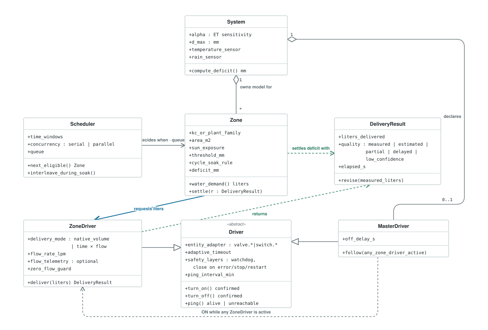
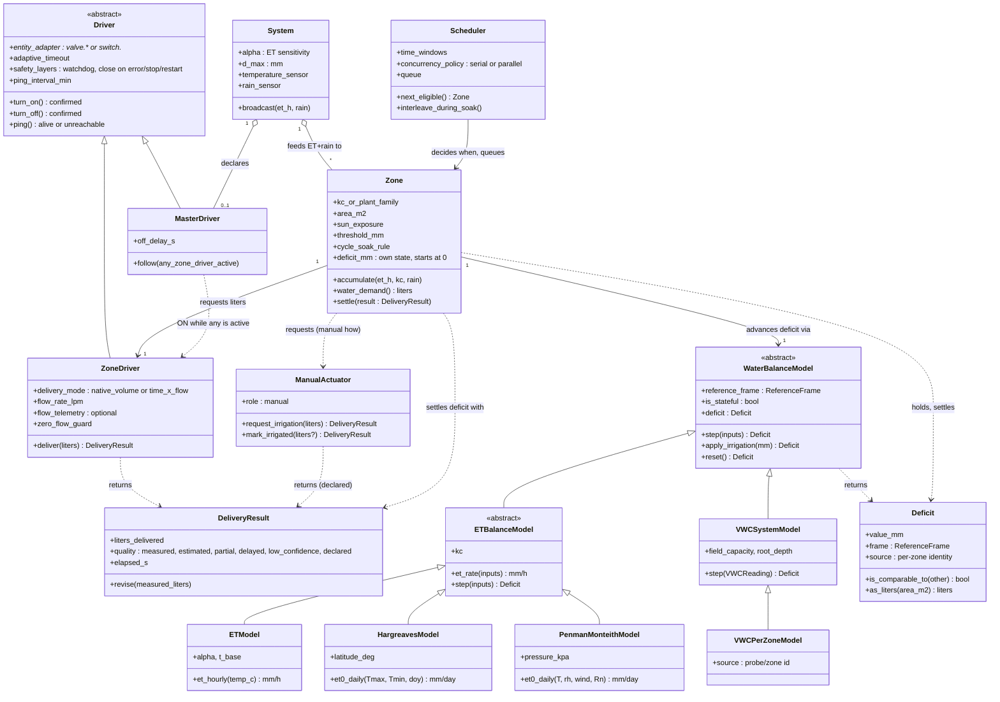

# Design — Domain Object Model

**Status:** Draft
**Date:** 2026-07-05 (updated 2026-07-06 with review feedback from GH #74; 2026-07-23 aligned with the water-balance reference model; 2026-07-26 the water-balance model made a first-class object)
**Related:** GH #74 (actuator abstraction discussion), GH #94 (`valve.*` support), GH #95 (master valve/pump), [Water-Balance Reference Model](design_water_balance_reference_model.md) (where the deficit lives), [Domain Model Anomalies](design_domain_model_anomalies.md) (code-verified audit against this model)

## Purpose

Define the conceptual objects of NeverDry's irrigation domain, independent of the current
module layout. This model guides where new features belong (e.g. "does the master valve go
in the scheduler or in the system?") and what should become an explicit first-class object
as the codebase evolves. For the current module/data-flow architecture see
`developer_manual.md` §1.

## The five objects

| Object | Responsibility | Key attributes |
|---|---|---|
| **System** | Shared **feeds** and global model params | α (ET sensitivity), D_max, the temperature + rain sensors it broadcasts to zones; *declares* the master valve/pump. **The deficit is not held here — it lives per-zone** (see Water-Balance Reference Model) |
| **Zone** | Irrigation unit; owns its deficit and translates it into water demand | Kc / plant family, area, sun exposure; cycle & soak rule; **its own deficit** (`+ET·Kc·Δt − rain − irrigation`, new zone starts at 0); translates mm → liters |
| **Scheduler** | The *when* — and the concurrency policy | Time windows, sequences, calendars; serial vs parallel zone runs, interleaving during soak |
| **ZoneDriver** | The *how* — actuation of one zone's water demand | Entity adapter (`valve.*`/`switch.*`), delivery mode (native volume in liters vs time in seconds via flow rate), flow rate, zero-flow guard; returns a **DeliveryResult** |
| **MasterDriver** | Coordination of shared hydraulics (pump / master valve) | ON when any ZoneDriver is active, OFF when none; configurable off-delay; no notion of liters |

ZoneDriver and MasterDriver are two specializations of a common **Driver** base, which owns
what they share: the entity adapter, ON/OFF command with state confirmation, adaptive
latency/timeout, and the safety layers (watchdog, close on error/stop/restart).

## The water-balance model (the *how much*)

Where the **Driver** abstracts the *how* of actuation, the **WaterBalanceModel** abstracts the
*how much*: the scientific computation of a zone's water demand. It is the object that turns
whatever inputs a user's setup provides into a **Deficit**. It has two symmetries with the
Driver side, and modeling it explicitly buys the same thing the Driver did:

| Sensing side (*how much*) | Actuation side (*how*) |
|---|---|
| **WaterBalanceModel** (abstract strategy) | **Driver** (abstract) |
| ↳ `ETModel`, `VWCSystemModel`, `VWCPerZoneModel` | ↳ `ZoneDriver`, `MasterDriver` |
| **Deficit** (mm + reference frame) — the value returned | **DeliveryResult** (liters + quality) — the value returned |

- **WaterBalanceModel** — a strategy that produces a `Deficit`. Its concretes mirror the
  reference frames of the [Water-Balance Reference Model](design_water_balance_reference_model.md):
  the ET frame is an abstract `ETBalanceModel` (shared forward-Euler integration, pluggable ET
  rate) with three **tiers** by input cost — `ETModel` (temperature-only, today's baseline; any
  user can run it), `HargreavesModel` (FAO-56 Hargreaves-Samani; adds the diurnal temperature
  range, its radiation term is computed from latitude + date, so still **no extra sensor**), and
  `PenmanMonteithModel` (FAO-56 Penman-Monteith, physically grounded, needs humidity + wind + net
  radiation — inputs not every user has); plus `VWCSystemModel` (one system moisture probe,
  stateless) and `VWCPerZoneModel` (a per-zone probe — the AI-174 target). Adding a tier is one
  new `et_rate`, not a new integrator: the "user picks the ET method their sensors support"
  design falls straight out of the output seam.
- **Deficit** — the value object every model returns: millimetres **plus the reference frame**
  they are defined against. A bare number is not enough — the reference model's load-bearing rule
  is that *two deficits are comparable only within one frame*, so the frame (and, for per-zone
  probes, the source identity) travels with the value.

**The seam is the output, not the input.** The three models share no inputs — ET needs weather,
VWC needs a probe, and not every user has a soil-moisture sensor. What they share is the
**output**: every model yields a `Deficit` in mm. This is precisely why plug-and-play works at
the output and not the input: each model copes with the sensors it has and exposes the same
quantity, so a setup can switch models (or fall back ET ⇄ VWC) without the Zone knowing which
one ran. This also unifies the ET formula that today lives in two places (`ETSensor` and
`DrynessIndexSensor`) into a single `ETModel.et_hourly`.

Ownership follows the reference model unchanged: the **System** owns the shared feeds/probe, the
**Zone** owns its `Deficit` and its `Kc`. The model is the *mechanism* the Zone uses to advance
that deficit; `Kc` is passed into a per-zone `ETModel` instance (the system reference uses
`Kc = 1.0`), because per-zone irrigation resets are independent and a shared reference cannot be
scaled proportionally after the fact.

## Translation chain

```
System     provides the ET + rain feeds         α, D_max, temperature + rain sensors
   │
Zone       accumulates its own deficit (mm)      +ET·Kc·Δt − rain − irrigation; new zone starts at 0
   │        then translates mm → liters (area)   applies cycle & soak
   │
ZoneDriver translates liters → actuation        native volume if supported,
   │                                            else seconds via flow rate
Scheduler  decides in which window it happens
```

Liters are the **contract** between Zone and ZoneDriver: the zone always requests liters;
only the driver knows whether to deliver them by volume or by time. This makes the fallback
natural — same request, two actuation strategies.

The contract is a **round trip**: the driver does not just execute "water X liters", it
returns a **DeliveryResult** — the liters actually delivered, stated as truthfully as the
backend allows (see the design decision below).

## Class diagram



*Rendered diagram (`assets/domain_model_uml.svg`) — blue is the liters contract going
down, green is the truth flowing back. The Mermaid source below is the normative
definition; keep the two in sync.*



`ManualActuator` is a third materialization of the *how* — but deliberately **not** a
`Driver`: there is no entity, no FSM, no safety layers to inherit. It shares only the delivery
**contract** (`→ DeliveryResult`), so the Zone settles its deficit identically whether the
water came from a valve or a watering can.

Reading keys: liters flow down the association `Zone → ZoneDriver` and truth flows back up as
a `DeliveryResult`; the `Scheduler` never touches drivers — it only decides *which zone when*
(and, with cycle & soak, may interleave another eligible zone during a soak pause);
`MasterDriver` reacts to the aggregate driver activity, it takes no decisions. The liveness
`ping()` lives in the abstract `Driver`, so both specializations inherit it.

## The classes in detail

Attribute-by-attribute and method-by-method reference for each class, with the
responsibility that justifies every member. This expands the diagram above; the
diagram stays the source of truth for relationships.

### System

The global model and shared infrastructure. *Declares* the master valve/pump but never
commands it.

| Member | Kind | Meaning |
|---|---|---|
| `alpha` | attr | ET sensitivity of the model (mm/°C/day) |
| `d_max` | attr | Cap on the accumulable deficit (mm) |
| `temperature_sensor` | attr | Shared temperature sensor |
| `rain_sensor` | attr | Shared rain sensor (event or cumulative type) |
| `compute_deficit() → mm` | method | FAO-56 water balance: reference deficit at Kc = 1 |

### Zone

The irrigation unit: translates the model into water demand and settles the deficit with
the driver's reported truth.

| Member | Kind | Meaning |
|---|---|---|
| `kc_or_plant_family` | attr | Crop coefficient (or the plant family that determines it) |
| `area_m2` | attr | Irrigated surface |
| `sun_exposure` | attr | Per-zone sun exposure factor |
| `threshold_mm` | attr | Deficit threshold that triggers irrigation |
| `cycle_soak_rule` | attr | Cycle & soak rule (dose/pause) — a Zone rule, not a scheduler one |
| `deficit_mm` | attr | Current zone deficit |
| `water_demand() → liters` | method | mm → liters via area and efficiency; liters are the contract towards the driver |
| `settle(r: DeliveryResult)` | method | Scales the deficit by the actually-delivered liters — exactly once |

### Scheduler

The *when* and the concurrency policy. It never touches drivers: it only decides which
zone runs in which window.

| Member | Kind | Meaning |
|---|---|---|
| `time_windows` | attr | Time windows and calendars |
| `concurrency` | attr | Serial or parallel zone runs |
| `queue` | attr | Queue of eligible zones |
| `next_eligible() → Zone` | method | Next zone to serve, per queue and windows |
| `interleave_during_soak()` | method | During a soak pause it may interleave another eligible zone |

### Driver «abstract»

The common base of the two specializations: everything about commanding a physical entity
and not blindly trusting the answer.

| Member | Kind | Meaning |
|---|---|---|
| `entity_adapter` | attr | Adapter over the HA entity (`valve.*` or `switch.*`) |
| `adaptive_timeout` | attr | Verification window adapted to observed latency (rolling mean + 3σ) |
| `safety_layers` | attr | Watchdog; close on error/stop/restart |
| `ping_interval_min` | attr | Active liveness: periodic ping, not just passive state |
| `turn_on() / turn_off()` | method | Command with state confirmation (and bounded retry with backoff) |
| `ping() → alive \| unreachable` | method | Reachability check independent of commands |

### ZoneDriver

The *how* for a single zone: receives liters, picks the actuation strategy, returns the
truth.

| Member | Kind | Meaning |
|---|---|---|
| `delivery_mode` | attr | `native_volume` when the device doses in liters, otherwise `time × flow` (seconds via flow rate) |
| `flow_rate_lpm` | attr | Nominal guard flow rate (L/min) |
| `flow_telemetry` | attr | Flow telemetry, when available (optional) |
| `zero_flow_guard` | attr | Guard against zero-flow sessions |
| `deliver(liters) → DeliveryResult` | method | Actuates the request and reports delivered liters with their degree of truth |

### MasterDriver

Coordinates the shared hydraulics (pump / master valve). Reacts to aggregate driver
activity, takes no decisions, has no notion of liters.

| Member | Kind | Meaning |
|---|---|---|
| `off_delay_s` | attr | Linger delay after the last active zone |
| `follow(any_zone_driver_active)` | method | ON while any ZoneDriver is active, OFF (after the linger) when none is |

### DeliveryResult

The return trip of the truth: the driver does not just execute — it states how much it
delivered and how much that figure can be trusted.

| Member | Kind | Meaning |
|---|---|---|
| `liters_delivered` | attr | Liters actually delivered, as far as the backend allows to know |
| `quality` | attr | `measured` · `estimated` · `partial` · `delayed` · `low_confidence` |
| `elapsed_s` | attr | Real session duration |
| `revise(measured_liters)` | method | Late revision for slow-reporting backends (e.g. Hydrawise): the true measure arrives later and corrects the estimate |

**Proposed addition (backlog AI-163, not yet part of the model):** a `device_reported`
quality level between `measured` and `estimated`, fed by the device's own end-of-session
report (duration + start/end volume — e.g. Sonoff SWV via Z2M). Some valves cannot stream
flow in real time but do report a trustworthy session total: more truthful than a
`flow_rate × time` estimate, less than live metering. It belongs to the driver as a
capability and will land with the driver abstraction.

## Design decisions

### The deficit lives in the Zone; the System holds feeds, not state

The System is not a global deficit. It owns the two shared **feeds** — the
temperature sensor (→ ET) and the rain sensor — and broadcasts them; each Zone
accumulates **its own** deficit (`+ET·Kc·Δt − rain − irrigation`). Irrigating a
zone resets only that zone. A new zone starts at 0 rather than inheriting a
global reference, which drifts high under per-zone irrigation. The old global
"Dryness Index" accumulator is retired as ET state (kept only as an interim
system-level value for the single-probe VWC mode). The full rationale, reference
frames, and the retire/keep table are in the
[Water-Balance Reference Model](design_water_balance_reference_model.md)
(decisions D1–D5).

### Master valve/pump: declared in System, executed by a Driver

The master valve is not scheduling logic — it takes no decisions. It reacts to the aggregate
execution state (an OR over zone drivers), with an off-delay to avoid pump cycling during
sequential zone runs. It is shared hydraulic infrastructure, like the global sensors, so its
*configuration* lives at system level (as requested in GH #95: "master entity configurable at
integration level").

Its *execution* however is a Driver: modeling it as a Driver specialization means the safety
layers (never leave the pump running on error/stop/restart) are written once in the base and
inherited — instead of duplicating watchdog and error handling inside "system" as a special
case.

### Cycle & soak: a Zone rule

Cycle/soak parameters depend on soil infiltration rate and zone properties (slope, soil
type), so they are per-zone configuration. The *execution* of the cycles is driver/controller
mechanics, but the rule lives in the Zone.

### DeliveryResult: the driver reports the most truthful delivered value it can

*From the GH #74 review (fpytloun, 2026-07-06).* Estimating delivered liters from expected
flow can diverge badly from reality — a dirty filter reduces the actual flow rate; a backend
like Hydrawise refreshes measured values only periodically, so the true figure may arrive
late. And for some backends, **command acceptance, physical valve state, and final measured
delivery are three distinct moments**, not one.

The driver therefore returns a **DeliveryResult**, not a bare number: delivered liters plus a
**quality qualifier** — `measured`, `estimated`, `partial`, `delayed`, `low-confidence`. Rules:

- The driver always reports the *most truthful* value available for its backend: cumulative
  flow-meter reading first, flow-rate integration second, configured flow × elapsed time as
  the estimated floor, each labeled accordingly.
- A result may be **revised**: a backend that reports measured volume late (e.g. a periodic
  API refresh) first returns an estimated/`delayed` result and corrects the deficit settlement
  when the measured figure lands.
- A `partial` or zero result with the valve confirmed open still **settles the deficit** with
  the best available estimate — the water was physically delivered whether or not it was
  measured (this is the field bug behind the zero-measured-flow timeout: an unmeasured
  session must never leave the deficit untouched and trigger a retry loop).

The Zone consumes the DeliveryResult to settle its deficit; the quality qualifier flows into
diagnostics (session log, `SESSION_RESULT`) so the user can see *how* the figure was obtained.

**Cycle & soak makes delivery self-correcting.** When a zone waters in cycles, the gap
between the liters requested and the most truthful delivered value of one cycle is simply
added to the next cycle's request: an under-delivery (dirty filter, low pressure, partial
result) is **replenished within the same session**, instead of surfacing a day later as
residual deficit. This is a direct synergy between the DeliveryResult contract and the
cycle & soak rule — it requires truthful per-cycle accounting to work.

### Manual actuation: a valve-less *how* for hand-watered plants

*Idea 2026-07-26.* Not every plant has a valve. A **house plant** is watered by hand, so its
"actuation" is a person: NeverDry raises an **alert** when the deficit says water is due, and
the user presses **Mark irrigated** once they have watered. `ManualActuator` models this as a
third materialization of the *how* — a materialization that proves the abstraction, because it
has **no hardware at all**.

It deliberately does not extend `Driver`/`Actuator`: there is no entity, no FSM, no watchdog,
no liveness. It shares only the delivery **contract** (`→ DeliveryResult`), so the Zone settles
its deficit identically whether the water came from a valve or a watering can. Two existing
pieces are reused rather than reinvented: the alert is a **notification**, and **Mark
irrigated** is the existing `reset_deficit` action, here doubling as the delivery confirmation.
The human-paced, asynchronous nature is already covered by the DeliveryResult contract:
`request_irrigation()` returns a `delayed` pending result and `mark_irrigated()` the final one,
tagged with a new **`declared`** quality (assumed/declared by a human, not measured) — a person
is simply the extreme case of "a backend that measures late".

**Actuation and model are orthogonal.** A house plant picks the manual *how* **and** the right
*how much*: indoors the demand is not weather-driven, so it pairs with a VWC / indoor
water-balance model, **not** `ETModel`. The two axes (`Actuator` family × `WaterBalanceModel`
family) compose freely — a house plant is just one corner of that grid.

**To explore (open questions, not decided):**
- A **placement attribute** on the Zone — `indoor` / `outdoor` / `greenhouse` — that could
  select sensible defaults (which water-balance model, exposure, whether ET applies at all).
- A **pot-based characterization** for house-plant zones: today a zone's water is `area × root
  depth`; a potted plant is bounded instead by **pot volume**, and its evapotranspiring surface
  is better described by **plant height / canopy diameter** than by ground area. This likely
  wants its own "pot" water model (a sibling of the VWC/ET models) rather than stretching the
  open-field geometry.

### Serial vs parallel irrigation: a Scheduler policy

*From the GH #74 review (fpytloun, 2026-07-06) and the shared-resource discussion earlier in
the thread.* Whether two zones may run at the same time is not a property of a zone or a
driver — it is a property of the shared hydraulics (one well, one pipe, one pump) and
therefore a **Scheduler policy**:

- **Serial** (default for shared-resource systems): one zone runs at a time; eligible zones
  queue.
- **Parallel**: zones with independent hydraulics may overlap.
- **Soak interleaving**: soak pauses are schedulable time — while one zone is soaking,
  another eligible zone can run its cycle, then control returns. This keeps total watering
  windows short without violating the one-valve-at-a-time constraint.

The queue/scheduler implementation stays deferred until real demand for parallel zones shows
up (as agreed in GH #74), but the model reserves the concept now so cycle & soak (a Zone
rule) and concurrency (a Scheduler policy) don't get entangled when either lands.

### Driver liveness: an active availability ping, not just passive state

Passive observation of the HA entity is not enough to know a valve is reachable. A WiFi
valve that drops off the network is marked `unavailable` by its integration; a **Zigbee
valve** often is not — availability tracking in Z2M/ZHA is optional or slow for
battery-powered (sleepy) end devices, so the entity can keep showing a stale `off` for hours
after the device is gone. Discovering that at irrigation time is too late.

The Driver base therefore owns an **active liveness probe**: every *N* minutes (configurable)
it verifies the device is actually reachable, using the cheapest backend-appropriate means —
an attribute read / availability-topic check for Zigbee (MQTT), the entity's own
availability for backends that report it honestly. Probe outcomes feed the existing
machinery rather than inventing a new one: a failed probe drives the FSM `unreachable` state
and the `UNREACHABLE_PASSIVE` / `UNREACHABLE_AT_IRRIGATION` notifications, so the user learns
about a dead valve *before* the next scheduled run, not from a failed one.

### Naming candidate: `System` is really `Weather` / `Environment` (proposal)

**Status: Proposed (note, not yet decided).** The object today called **System** does one thing:
it owns the shared **environmental feeds** (temperature + rain → `et_h`, `rain_delta`) and
broadcasts them to the zones. "System" is a catch-all name that describes *where it sits*, not
*what it does*. A name that matches its responsibility — **`Weather`** or **`Environment`** — would
sharpen the ubiquitous language: the zones consume an environment, not "the system". (Caveat: it
also *declares* the master valve/pump — a non-environmental concern; if the rename is adopted, that
declaration may want to move, or stay as a documented exception.)

**Extension enabled by the rename** — if the object is explicitly the environment/weather source, two
forecast-driven properties become natural, both **configurable from the config flow** as properties of
this entity:
- **`rain_probability`** — actual rain probability (from the weather forecast), exposed as a feed
  alongside temperature and rain.
- **`rain_delay_above_threshold`** — if `rain_probability` is above a configurable threshold, delay
  irrigation by a configurable amount. This is a *decision input* the environment provides; the
  Scheduler/Zone consumes it (keeps the "environment supplies feeds, zone/scheduler decides" split
  intact — the environment does not itself skip watering, it just raises the probability signal).

Open questions before promoting to a decision: does the delay live as an Environment property or a
Scheduler policy (cf. cycle&soak = Zone rule, serial/parallel = Scheduler policy)? Interaction with
the existing rain-delta/water-balance rain memory (avoid double-counting forecast vs measured rain).
Tracked in the backlog; keep here as a naming/evolution note until decided.

## Mapping to current code (2026-07-05)

| Object | Current state |
|---|---|
| System | ✅ explicit: config entry globals, `ETSensor`, `DrynessIndexSensor` — now the **feed hub / broadcaster** (temperature + rain → `et_h`, `rain_delta` → zones). Its `_deficit` accumulator is being **retired as ET state** and survives only as the interim VWC-system value (Water-Balance Reference Model, D2/D5) |
| Zone | ✅ explicit: `IrrigationZoneSensor`, per-zone config (Kc, area, sun exposure). `_zone_deficit` is **authoritative**; a new zone **starts at 0** (D4), not seeded from the global. Cycle & soak: not implemented |
| Scheduler | ⚠️ implicit and minimal: deficit-triggered daily cycle inside `IrrigationController`; no cron/sequences/calendars (deliberately — that is Irrigation Unlimited's territory). Concurrency is de-facto serial, not an explicit policy |
| ZoneDriver | ⚠️ exists but internal: `ValveOperator` (FSM, safety layers, latency tracker) + valve/switch adapter (GH #74/#94); native volume delivery in progress. Delivered liters returned as a bare float — no DeliveryResult qualifier yet. **Scaffold extracted**: `actuator.py` (`Actuator`/`ZoneActuator`/`MasterActuator`), inert until wired |
| MasterDriver | ❌ not implemented (GH #95); its scaffold lives in `actuator.py` (`MasterActuator`) |
| ManualActuator | ❌ not implemented; **scaffold extracted**: `ManualActuator` in `actuator.py` (valve-less, `request_irrigation`/`mark_irrigated` → `DeliveryResult(declared)`), inert. For hand-watered house plants — a *how* with no hardware |
| WaterBalanceModel | ⚠️ implicit today: the ET/VWC fork inside `DrynessIndexSensor._on_sensor_change` + the per-zone loop, with the ET formula duplicated in `ETSensor`. **Scaffold extracted**: `water_balance_model.py` (`WaterBalanceModel` + `ETBalanceModel` tiers `ETModel`/`HargreavesModel`/`PenmanMonteithModel` + `VWCSystemModel`/`VWCPerZoneModel`), pure, inert until wired |
| Deficit | ❌ today a bare `float` (`_zone_deficit`, `DrynessIndexSensor._deficit`) with the frame left implicit. **Scaffold extracted**: `Deficit` value object in `water_balance_model.py` |

The refactoring direction is symmetric on both axes: make the **Driver** base explicit when
implementing GH #95 (so `MasterActuator` inherits the safety layers rather than reimplementing
them), and make the **WaterBalanceModel** explicit so the ET/VWC switch becomes polymorphic
dispatch over a shared `Deficit` output instead of an `if self._vwc_sensor:` fork with a
duplicated ET formula. Both scaffolds already exist as pure/self-contained modules; the
remaining phase is wiring the existing call sites onto them.
